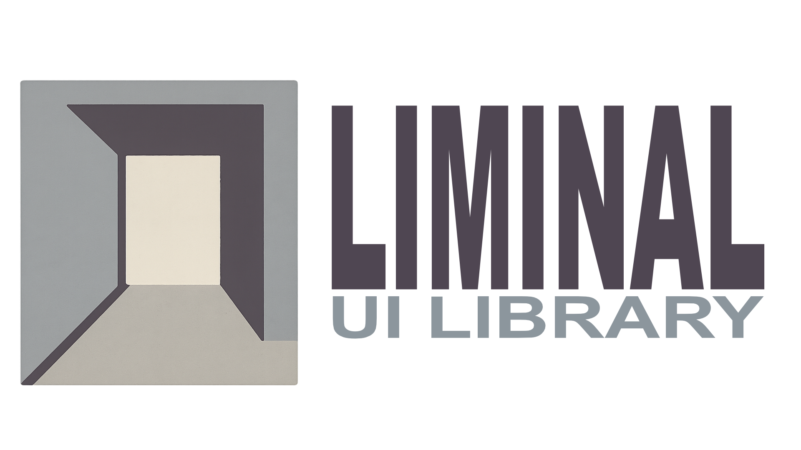

<div align="center">
  

  # Liminal UI Library

  **A modern React component library featuring WebGL-powered effects and animations.**
</div>

<p align="center">
  <a href="https://www.npmjs.com/package/liminal-ui-library">
    
  </a>
  <a href="https://www.npmjs.com/package/liminal-ui-library">
    
  </a>
  <a href="https://github.com/The-Genium007/liminal-ui-library/blob/main/LICENSE.md">
    
  </a>
</p>

---

## About

**Liminal** is a curated collection of React components I've built over time. This library serves as a central repository for all the custom components I create, from simple UI elements to complex WebGL-powered animations.

While this project is continuously evolving and may not be perfect, it represents my journey in learning and mastering modern web development. Each component is crafted with care, and I'm committed to improving the library over time based on real-world usage and feedback.

### Why Liminal?

- **Personal Learning Lab**: A space where I experiment, learn, and refine my React and TypeScript skills
- **Production-Ready Components**: Despite being a learning project, all components are built with production use in mind
- **Open to Feedback**: I'm eager to learn from the community—whether it's about security, performance optimization, or best practices

> **Note**: This is an ongoing project, and I'm always looking to improve. If you have suggestions, find bugs, or have ideas for optimization, please don't hesitate to reach out!

---

## Installation

Install the library via npm:

```bash
npm install liminal-ui-library
```

Or using yarn:

```bash
yarn add liminal-ui-library
```

**NPM Package**: [liminal-ui-library](https://www.npmjs.com/package/liminal-ui-library)

---

## Quick Start

```tsx
import { FusionBall } from 'liminal-ui-library';
import 'liminal-ui-library/styles';

function App() {
  return (
    <div style={{ width: '100%', height: '600px', background: '#000' }}>
      <FusionBall
        color="#ffffff"
        speed={0.3}
        ballCount={15}
        enableMouseInteraction={true}
      />
    </div>
  );
}
```

---

## Components

### FusionBall

A stunning WebGL-powered metaball animation with smooth mouse interaction and highly customizable visual effects.

```tsx
<FusionBall
  color="#ffffff"
  speed={0.3}
  ballCount={15}
  enableMouseInteraction={true}
/>
```

### AccordionSlider

An interactive accordion-style image slider with smooth transitions and responsive design.

```tsx
<AccordionSlider
  images={[
    { src: 'image1.jpg', alt: 'Description 1' },
    { src: 'image2.jpg', alt: 'Description 2' },
    { src: 'image3.jpg', alt: 'Description 3' }
  ]}
/>
```

---

## Development

### View Components in Storybook

To explore all components with interactive controls:

```bash
npm install
npm run storybook
```

This will start Storybook on [http://localhost:6006](http://localhost:6006)

### Available Scripts

```bash
npm run dev              # Start Vite dev server
npm run build            # Build library for production
npm run storybook        # Start Storybook development server
npm run build-storybook  # Build static Storybook site
npm run test-storybook   # Run Storybook tests
```

### Project Structure

```
liminal/
├── .storybook/           # Storybook configuration
│   ├── assets/           # Images and static assets
│   └── ...
├── src/
│   ├── components/
│   │   ├── FusionBall/
│   │   │   ├── FusionBall.tsx
│   │   │   ├── FusionBall.module.scss
│   │   │   ├── FusionBall.stories.tsx
│   │   │   └── index.ts
│   │   └── ...           # More components coming soon
│   └── index.ts          # Main entry point
├── dist/                 # Built files (generated)
└── package.json
```

---

## Browser Support

- Modern browsers with **WebGL 2.0** support
- Chrome, Firefox, Safari, Edge (latest versions)
- Mobile browsers with WebGL support

---

## Feedback & Contributions

I'm always looking to improve and learn! If you have:

- **Security concerns** or vulnerability reports
- **Performance optimization** suggestions
- **Bug reports** or feature requests
- **General feedback** on code quality or architecture

Please feel free to:
- Open an [issue on GitHub](https://github.com/The-Genium007/liminal-ui-library/issues)
- Submit a pull request
- Reach out directly

I'm here to learn and grow as a developer, and any constructive feedback is highly appreciated!

---

## License

**Dual License** - Choose the license that fits your use case:

- **Non-Commercial**: Free for personal, educational, and open-source projects
- **Commercial**: Required for commercial use (SaaS, products, services generating revenue)

See [LICENSE.md](LICENSE.md) for full details.

For commercial licensing inquiries, please [open an issue](https://github.com/The-Genium007/liminal-ui-library/issues) on GitHub.

© [The-Genium007](https://github.com/The-Genium007)

---

## Dependencies

- **React** 18+
- **TypeScript** 5+
- **OGL** - Lightweight WebGL library
- **SCSS** for styling

---

<p align="center">
  Made with ❤️ by <a href="https://github.com/The-Genium007">The-Genium007</a>
</p>
